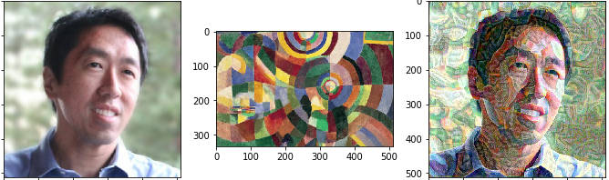

# Neural Style Transfer (NST)

We basically want to do this  

By the end of this notebook, you'll understand and implement the algorithm that can achieve this goal.  
After that, I encourage you to play around with other models and try to get better results.
